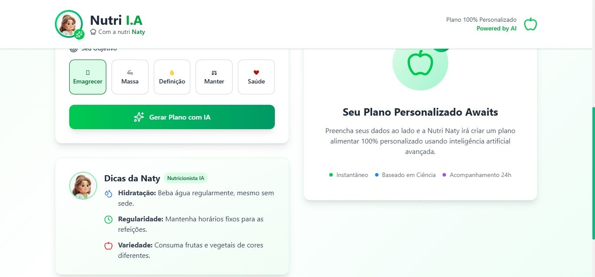
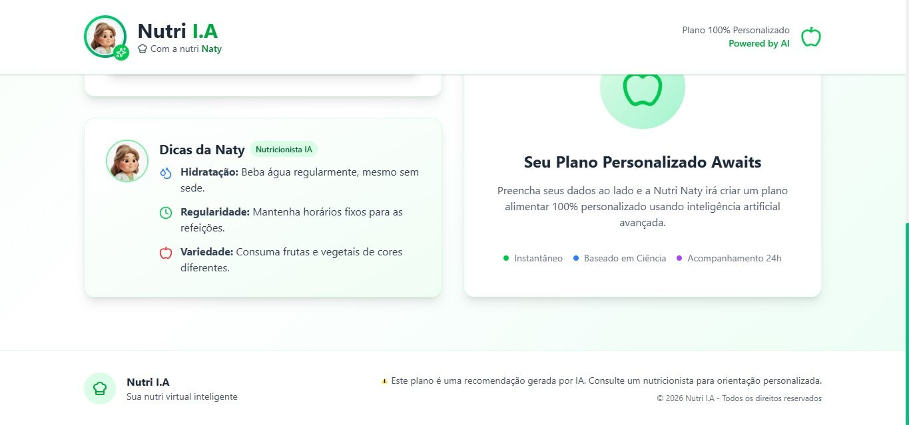
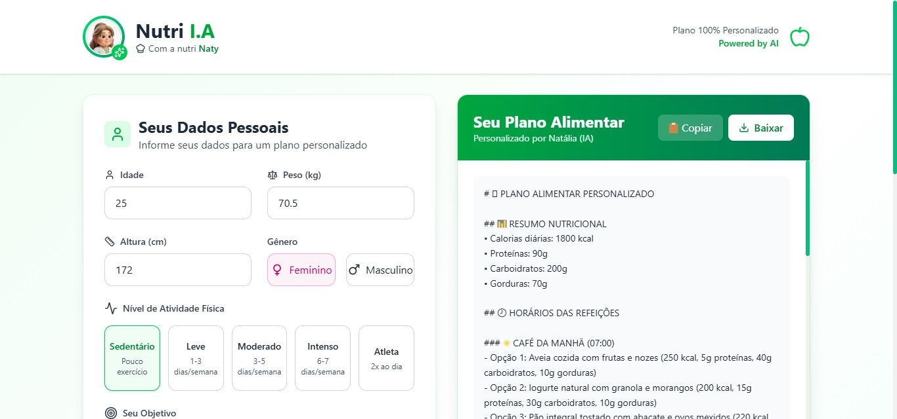

# 🥗 Nutri IA — Sua Nutricionista Virtual Inteligente

Gere planos alimentares personalizados em segundos com tecnologia de **Inteligência Artificial**.

O **Nutri IA** é uma aplicação web completa que utiliza IA avançada para criar **planos alimentares 100% personalizados**.  
Com base nos seus dados físicos, objetivos e estilo de vida, a plataforma gera **recomendações nutricionais detalhadas**, prontas para você seguir.

---

## ✨ Funcionalidades Principais

- **Planejamento Inteligente**  
  Informe idade, peso, altura, nível de atividade e objetivo.

- **Cálculo Automático de IMC**  
  Visualize instantaneamente seu Índice de Massa Corporal e classificação.

- **IA Personalizada**  
  Planos gerados pelo modelo **Llama 3.3-70B** via **GROQ**.

- **Formatos Prontos para Uso**  
  Planos estruturados com horários, alimentos e valores nutricionais.

- **Totalmente Responsivo**  
  Interface otimizada para celular, tablet e desktop.

- **Download Fácil**  
  Baixe o plano em texto ou copie para a área de transferência.

---

## 🚀 Começando

### 📋 Pré-requisitos

- **Node.js** 18 ou superior  
- **Conta na GROQ Cloud** (gratuita)

---

## 🔧 Instalação Passo a Passo

### 1️⃣ Clone o repositório

```bash
git clone https://github.com/seu-usuario/nutri-ia.git
cd nutri-ia
```

### 2️⃣ Configure o Backend

```bash
cd backend
npm install
cp .env.example .env
```

### 3️⃣ Configure sua chave da GROQ

1. Acesse: https://console.groq.com  
2. Crie uma conta gratuita  
3. Gere uma **API Key**  
4. Cole no arquivo `.env`:

```env
GROQ_API_KEY=sua_chave_aqui
PORT=5000
```

### 4️⃣ Inicie o Backend

```bash
npm run dev
```

Servidor disponível em:  
http://localhost:5000

---

### 5️⃣ Configure o Frontend

```bash
cd ../frontend
npm install
```

### 6️⃣ Inicie o Frontend

```bash
npm run dev
```

Aplicação disponível em:  
http://localhost:5173

---

## 🏗️ Arquitetura do Projeto

### Backend (Node.js + Express)

```text
backend/
├── controllers/    # Lógica de negócio
├── models/         # Modelos de dados
├── routes/         # Endpoints da API
├── services/       # Integração com GROQ
├── utils/          # Validações e helpers
└── server.js       # Ponto de entrada
```

### Frontend (React + Vite)

```text
frontend/
├── src/
│   ├── components/        # Componentes reutilizáveis
│   │   ├── layout/        # Header, Footer
│   │   ├── plano/         # Formulário, Resultado
│   │   └── ui/            # Botões, Loading
│   ├── context/           # Gerenciamento de estado
│   ├── services/          # Comunicação com API
│   └── utils/             # Funções auxiliares
├── public/
└── vite.config.js
```

---

## 🛠️ Tecnologias Utilizadas

### Frontend
- React 19
- Vite
- Tailwind CSS
- Lucide Icons

### Backend
- Node.js
- Express.js
- GROQ SDK

### Inteligência Artificial
- **Llama 3.3-70B** via **GROQ API**

### Estilo
- CSS Flexbox e Grid
- Animações CSS

---

## 📋 Como Usar

### 1️⃣ Preencha o formulário
- Informe idade, peso e altura  
- Selecione o gênero  
- Escolha o nível de atividade física  
- Defina o objetivo principal  

### 2️⃣ Gere seu plano
- Clique em **“Gerar Plano com IA”**
- Aguarde alguns segundos enquanto a IA processa

### 3️⃣ Receba seu plano personalizado
- IMC calculado automaticamente
- Plano alimentar completo
- Baixe ou copie para usar quando quiser

---

## 🔧 Personalização

Para ajustar o **prompt da IA** ou o **formato das respostas**, edite:

```text
backend/services/groq.service.js
```

Para modificar o **design**, altere as classes do **Tailwind CSS** nos componentes React.

---

## 🤝 Contribuindo

Contribuições são muito bem-vindas!  
Sinta-se à vontade para:

- Reportar bugs ou problemas
- Sugerir novas funcionalidades
- Enviar *pull requests* com melhorias

---

## 📄 Licença

Este projeto está sob a licença **MIT**.  
Veja o arquivo **LICENSE** para mais detalhes.

---

## 👨‍💻 Autor

Desenvolvido com ❤️ por **Pedro Lombardi**

Se este projeto foi útil para você, considere dar uma ⭐ no repositório!

---

<p align="center"><a href="https://github.com/lucenarenato/nutri-naty-ai" target="_blank"></a></p>
<p align="center"><a href="https://github.com/lucenarenato/nutri-naty-ai" target="_blank"></a></p>
<p align="center"><a href="https://github.com/lucenarenato/nutri-naty-ai" target="_blank"></a></p>
<p align="center"><a href="https://github.com/lucenarenato/nutri-naty-ai" target="_blank"></a></p>